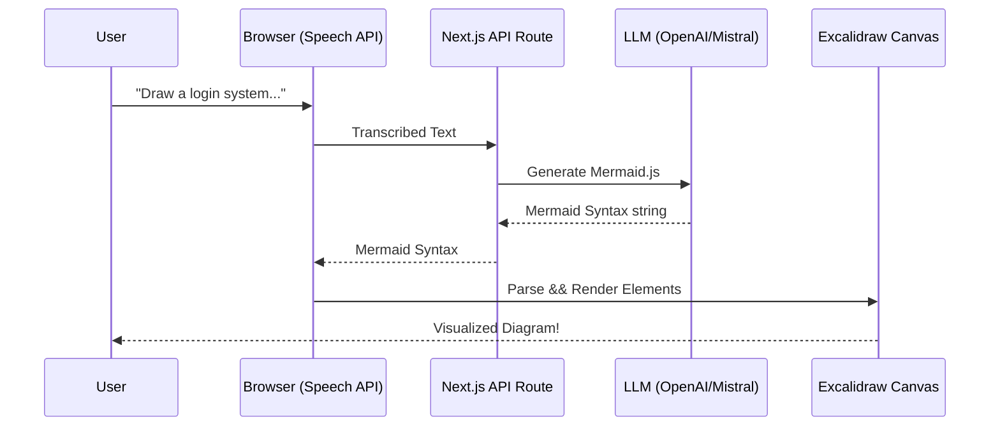

<div align="center">

# �️ Voice-Driven Excalidraw Clone 🎨

**A next-generation virtual whiteboard that listens to you.** <br />
Create diagrams, flowcharts, and mind-maps effortlessly using **natural language voice commands**, powered by the sleekness of **Excalidraw** and the intelligence of **Mistral/OpenAI**.

[](https://nextjs.org/)
[](https://www.typescriptlang.org/)
[](https://tailwindcss.com/)
[](https://excalidraw.com/)
[](https://opensource.org/licenses/MIT)

*Speak your ideas into existence. No more dragging and dropping—just thinking and talking.*

</div>

---

## 📖 Overview

The **Voice-Driven Excalidraw Clone** revolutionizes the way we brainstorm and visualize systems. Instead of manually clicking through toolbars and painfully aligning boxes, simply speak your mind. The integrated AI understands your request—whether it's a "User Login Workflow" or "Architecture Diagram"—and instantly renders elegant, fully-editable Excalidraw elements on your infinite canvas.

Built with **Next.js 14**, fully typed in **TypeScript**, and styled with **Tailwind CSS**, this workspace is incredibly fast, local-first, and highly intuitive. 

---

## ✨ Key Features

| Feature | Description |
| :--- | :--- |
| **🎙️ AI Voice Assistant** | Seamlessly understands natural language descriptions and deeply technical context using Web Speech API & LLMs. |
| **🧠 Intelligent Generation** | Converts spoken instructions into structured **Mermaid.js** flowcharts, then beautifully renders them onto the canvas. |
| **� Context-Aware** | Your AI assistant remembers the timeline. You can say *"Add a database layer after the API gateway"* and it will contextualize the update. |
| **🎨 Smart Layout Engine** | Elements are automatically positioned and spaced logically to avoid overlaps, making your diagrams instantly readable. |
| **� Local First** | Zero databases required. Your canvas state effortlessly persists in your browser's local storage. |
| **⚡ Real-time Feedback** | Visual indicators let you know when the AI is listening, processing, or actively generating elements. |

---

## 🏗️ Architecture Under the Hood

When you issue a voice command, a multi-step pipeline is securely executed in milliseconds:



---

## 🛠️ Technology Stack

- **Core Framework**: [Next.js 14](https://nextjs.org/) (App Router ready)
- **Language**: [TypeScript](https://www.typescriptlang.org/) for robust type-safety
- **Canvas Engine**: [@excalidraw/excalidraw](https://www.npmjs.com/package/@excalidraw/excalidraw)
- **Natural Language Parsing**: **Mistral AI** or **OpenAI API**
- **Syntax Conversion**: [@excalidraw/mermaid-to-excalidraw](https://www.npmjs.com/package/@excalidraw/mermaid-to-excalidraw)
- **Styling**: [Tailwind CSS](https://tailwindcss.com/)
- **Icons**: [Lucide React](https://lucide.dev/)

---

## � Project Structure

```bash
Voice-Driven-Excalidraw-Clone/
├── public/                 # Static assets
├── src/
│   ├── app/                # Next.js App Router (pages & API endpoints)
│   ├── components/         # Reusable UI components (Canvas, Mic Button, Toolbars)
│   ├── hooks/              # Custom React Hooks (e.g., useSpeechRecognition)
│   ├── lib/                # LLM integrations and utility functions
│   └── types/              # Global TypeScript interfaces
├── .env.example            # Environment variable template
├── tailwind.config.js      # Tailwind configurations & theme
└── package.json            # Project dependencies
```

---

## 🚀 Getting Started

Experience the voice-driven canvas directly on your local machine.

### Prerequisites

Ensure you have the following installed to run the project smoothly:
- **Node.js** (v18.x or newer strongly recommended)
- **npm** or **yarn** or **pnpm**
- An active API key from **Mistral AI** or **OpenAI**.

### Installation

1. **Clone the repository:**
   ```bash
   git clone https://github.com/chitranshuajmera0000/Voice-Driven-Excalidraw-Clone.git
   cd Voice-Driven-Excalidraw-Clone
   ```

2. **Install project dependencies:**
   ```bash
   npm install
   # or
   yarn install
   ```

3. **Configure Environment Variables:**
   Rename `.env.example` to `.env.local` or copy it:
   ```bash
   cp .env.example .env.local
   ```
   Add your respective API key inside `.env.local`:
   ```env
   MISTRAL_API_KEY=your_mistral_key_here
   # or if configured for OpenAI:
   OPENAI_API_KEY=your_openai_key_here
   ```

4. **Spin up the development server:**
   ```bash
   npm run dev
   # or
   yarn dev
   ```

5. **Let's Draw!** Open [http://localhost:3000](http://localhost:3000) in your modern browser (Chrome/Edge/Safari).

---

## 🎮 How to Use

Enjoying hands-free diagramming is simple:

1. **Find the Mic:** Click the **Microphone icon** located in the bottom central toolbar.
2. **Speak Your Mind:** Describe exactly what you want to visualize. 
   - *"Create a flowchart showing a user registration process."*
   - *"Draw a mind map for an e-commerce website architecture."*
   - *"Add a payments processing step right after checkout."*
3. **Watch the Magic:** The platform will transcribe your voice, hit the AI pipeline, and seamlessly generate the shapes.
4. **Edit Manually:** You are fully equipped with all standard Excalidraw tools to tweak, re-color, and customize the generated results!

---

## 🤝 Contributing

This project thrives on community involvement! Your ideas and code make the open-source ecosystem an extraordinary place to learn and build.

1. **Fork the repository** on GitHub.
2. **Create a Feature Branch:** `git checkout -b feature/IncredibleFeature`
3. **Commit your changes:** `git commit -m 'Add some IncredibleFeature'`
4. **Push to the branch:** `git push origin feature/IncredibleFeature`
5. **Open a Pull Request** summarizing your awesome upgrades.

*(Also, check out `IMPROVEMENTS.md` and `QUICK_FIXES.md` if you are looking for ideas on what to tackle first!)*

---

## 🛡️ License

This project is generously distributed under the **MIT License**. Check out the `LICENSE` file for more fine-print details.

---

## � Contact & Links

**Chitranshu Ajmera** 
- GitHub: [@chitranshuajmera0000](https://github.com/chitranshuajmera0000)

**Project Repository:** [https://github.com/chitranshuajmera0000/Voice-Driven-Excalidraw-Clone](https://github.com/chitranshuajmera0000/Voice-Driven-Excalidraw-Clone)

<div align="center">
  <sub>Built with ❤️ and powered by AI.</sub>
</div>